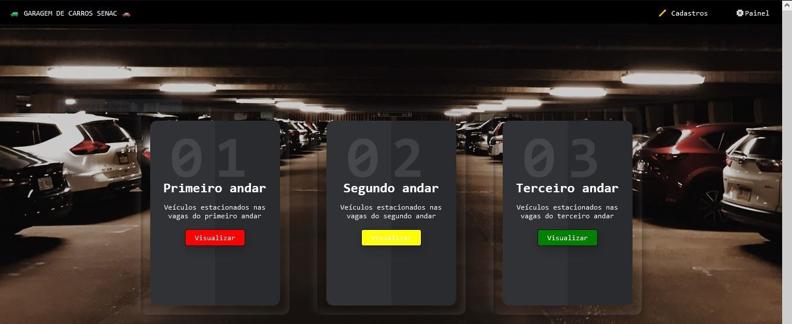
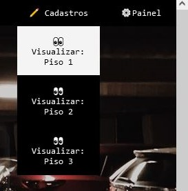
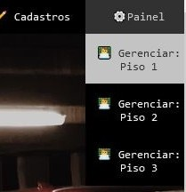
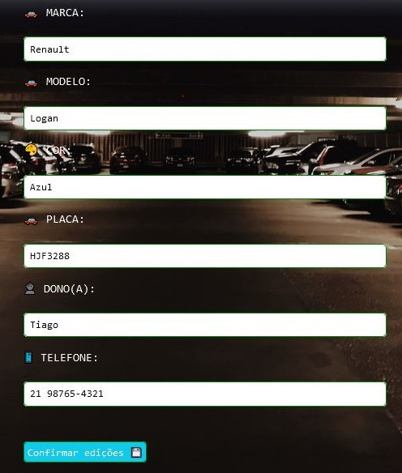

# Projeto em grupo do Módulo 3 - Sendo servido

### Integrantes do SQUAD

- Ana - Pessoa Gestora do Conhecimento
- Anna - Pessoa Gestora de Gente e Engajamento
- Filipe - Pessoa Co-Facilitadora
- Maycon - Colaborador I

##

### Proposta

- Criar um site utilizando o json.server O projeto deverá ser construído usando o framework React aprendido em aula, nele iremos desenvolver um site que deverá utilizar um servidor Json construído anteriormente. Este projeto deverá seguir um tema dos utilizados pelos integrantes no projeto individual.

##

### Requisitos

- ✅ Utilize endpoints do Json-server que foi criado no Projeto individual.
- ✅ Utilizar o README do repositório para documentação do projeto;
- ✅ Utilizar a biblioteca react-router-dom para roteamento das páginas;
- O site deve realizar todos os métodos HTTP:
- ✅ GET - Página para listar os cadastros ou produtos com opção de busca;
- ✅ POST - Página para incluir um novo registro ou produto;
- ✅ PUT - Página para editar os cadastros ou produtos;
- ✅ DELETE - Opção de excluir itens cadastrados.

##

### Introdução ao projeto

- Nosso projeto simula o sistema de gerenciamento de um estacionamento (Garagem de veículos) onde é possível cadastrar os veículos em cada vaga, de cada andar do prérdio. Também é possível editar o cadastro dos veículos e excluir o cadastro.

- Escolhemos a API produzida pelo Filipe com o tema "Garagem de carros"

> Disponível no repositório: [/Garagarem-de-Carros--Json-Server](https://github.com/Lype3d/Garagem-de-Carros--Json-Server)

- Para o projeto utilizamos uma versão adaptada da API com o mesmo tema.

> Disponível no repositório: [/individual3](https://github.com/dualsgo/individual-3) 
> O deploy no Render:  [/estao-servidos-xvs9](https://estao-servidos-xvs9.onrender.com/)

- A API conta com três rotas/endpoints que simulam andares de um prédio de estacionamento:

 > [/andar1](https://estao-servidos-xvs9.onrender.com/andar1) 
> [/andar2](https://estao-servidos-xvs9.onrender.com/andar2) 
> [/andar3](https://estao-servidos-xvs9.onrender.com/andar3)

- Cada rota conta com quatro entidades pré definidas e cada uma delas conta com sete atributos.

> { 
    "marca": "Renault",  
    "modelo": "Logan", 
    "cor": "Azul", 
    "placa": "HJF3288", 
    "dono": "Tiago", 
    "telefone": "21 98765-4321", 
    "id": 1 
    }

##

### Executando o projeto

- O projeto recebeu deploy em Netlify e pode ser executado online acessado através do link <https://squad-3.netlify.app/>

- O projeto também pode ser executado em servidor local, baixando uma cópia dos arquivos no repositório acessando o link <https://github.com/dualsgo/squad-3>

- Após o download e a inicialização, será necessário utilizar os comandos a seguir no terminal.

>npm install 
>npm run dev

- O servidor local será iniciado no navegador.

##

# GARAGEM DE VEÍCULOS

### Home:

<i>A Home conta com a barra de navegação com ancoragem para as demais rotas. Possui espaço para logo (Neste projeto não foi utilizado logo específico pois a ideia é vender um protótipo de sistema que será customizado ao gosto do cliente). Além disso conta com um menu de cadastro, onde é possível visualizar os veículos cadastrados e um menu de gerenciamento, para edições e exclusões de informações.</i>  

### Menus: 
<i>Os menus são retraidos e ao clicar exibem as ancoragem para as rotas.</i>  
 
<i>Rotas de visualização</i>  

 
<i>Rotas de edição e exclusão</i>  

### Rotas:

 
<i>As informações são exibidas em um container.</i>  

 
<i>Há uma pequena animação que é exibida enquanto as informações estão sendo requisitadas para serem exibidas para o usuário.</i>  

 
<i>Acima há dois botões que servem de atalho para visualizar (redireciona para a página de edição e exclusão) e um botão que redreciona para a página onde são adicionados novos itens.</i>  

### Editar:

 
<i>Na página de edições, as informações são exibidas em coluna para diferenciar do menu anterior. Abaixo ficam os para abrir o menu de edição e o botão de delete.</i>  

 
<i>Ao clicar no botão editar, uma janela é aberta com um formulário já preenchido com as informações atuais. O usuário deve selecionar a informação que deseja editar e ao final deve clicar no botão de confirmação. Se houver erro, uma pequena animação no formulário informa ao usuário oque deve ser corrigido. Em caso de sucesso, o usuário é redirecionado para a página de visualização.</i>  